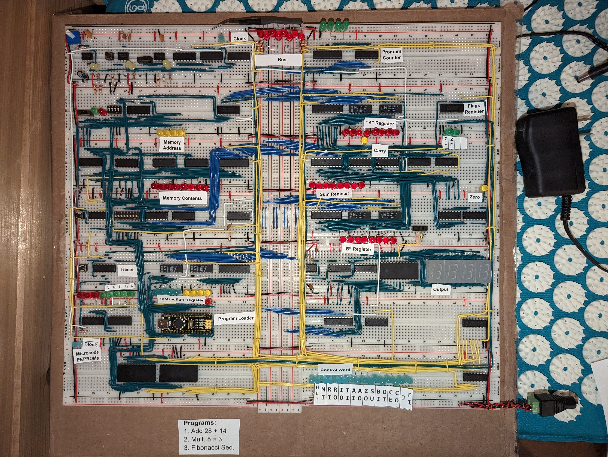

# Arduino RAM Programmer

This repository is a sketch for an Arduino Nano that allows loading predefined programs into Ben Eater's 8-bit breadboard computer. This sketch works on the Arduino that comes with the kit that is used in the EEPROM programmer. It uses direct port manipulation to quickly load programs into RAM for demonstration purposes.

Programs are stored in [RamProgrammer.ino](RamProgrammer.ino) as an array of `const char *` where each array item is an instruction. This `const char *` is then loaded into a `Program` object. We keep track of an array of these `Program` objects and swap through them as each program finishes. The program can read the halt line, and then wait 2 seconds before loading the next program (`POST_HLT_TIME`) or a timeout can be specified for a given program.

Below is the image of how it was added to the computer (beneath the instruction register):

